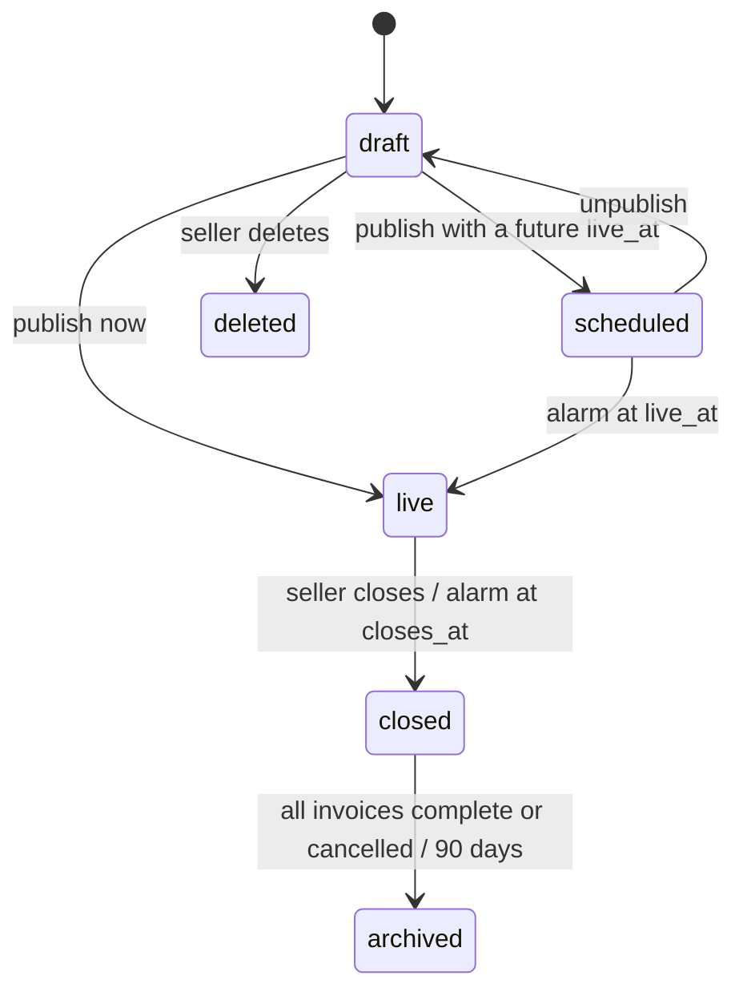
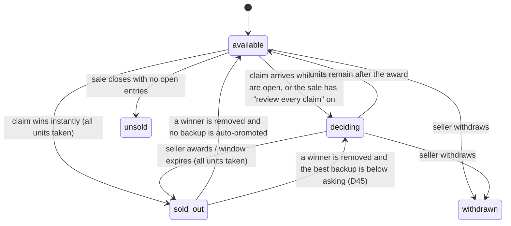
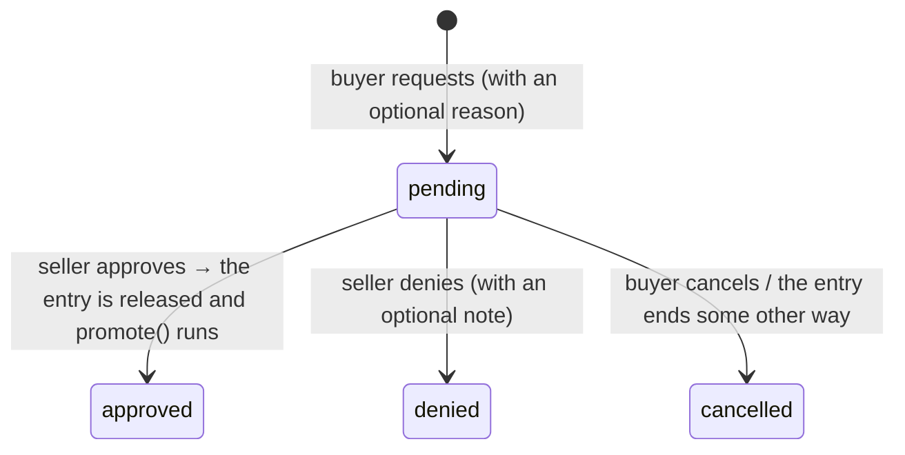
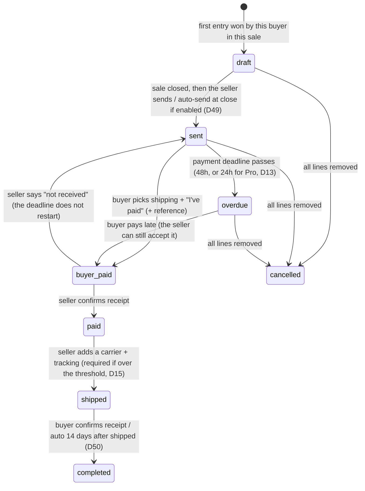

# State Machines and Rules

This document is the exact behavior spec for sales, items, entries (claims and
offers), take-backs and invoices. It is meant to be implemented as **pure
functions**: `(state, command, actor, now) → (newState, events)`. Those functions
are unit-tested without any I/O and called from the serialized write path
(see "Write path" at the end).

Decision references (D#) point to `PLAN.md` section 0.

---

## 1. Vocabulary

| Term | Meaning |
| --- | --- |
| **Entry** | One buyer's interest in one item. It is either a **claim** (at the asking price) or an **offer** (any amount, including above asking; D35). Claims and offers live in one table so they can be ranked together. |
| **Unit** | One sellable copy. An item with `quantity = 3` has 3 units. |
| **Won** | The entry holds a unit. It is binding and goes on the buyer's invoice. |
| **Open** | The entry is active but doesn't hold a unit. Depending on the item's state, it is either *awaiting the seller's decision* or a *backup*. |
| **Rank** | The order of open entries. Default: **amount descending, then time ascending**, so a claim at $40 ranks above an offer at $35, and an offer at $45 ranks above both. The seller can reorder manually (D44). |
| **Decision window** | The time the seller has to choose between a full-price claim and competing offers before the earliest claim wins automatically. **24h for free sellers; Pro sellers can configure it** (D25). |

---

## 2. Sale lifecycle



| State | Visible to buyers | Claims and offers | Notes |
| --- | --- | --- | --- |
| `draft` | No | No | Items can be edited freely. The free-tier item cap (10) is enforced on publish *and* on add. |
| `scheduled` | Yes (preview) | No, the buttons show a countdown | The preview opens at most 7 days before `live_at` (D42). Followers are notified on publish. |
| `live` | Yes | Yes | Maximum 14 days (D42). Price and quantity are locked on any item that has entries (D40). |
| `closed` | Yes (read-only) | No new entries | Decision windows, payment deadlines and promotions **keep running** after the sale closes. |
| `archived` | Yes, via the seller's history | No | |

**Free-tier limit:** at most 2 sales in `scheduled` + `live` at once (D30).

---

## 3. Item state (derived, never set by hand)

An item's displayed state is computed from its entries and units. It is stored
only as a cached column for filtering.



| Derived state | Condition |
| --- | --- |
| `available` | free units > 0 and no decision deadline is set |
| `deciding` | free units > 0 and `decision_deadline` is set |
| `sold_out` | free units = 0 (backups may still be open) |
| `withdrawn` | the seller withdrew the item; all entries end with `item_withdrawn` |
| `unsold` | the sale is closed, there are free units, and there are no open entries |

The buyer-facing badge also shows: **N claims / N offers** (counts are always
visible, D26), and offer **amounts** only if the sale's offer visibility is `visible` (D26).

---

## 4. Entry (claim / offer) lifecycle


Terminal states: `declined`, `withdrawn`, `lost`, `ended`, `rescinded`,
`released`, `fulfilled`. Each terminal transition records `ended_reason` and
`ended_by`, and writes an audit log row.

### 4.1 Placing an entry

Run atomically per item (see the write path):

```
place(item, buyer, kind, amount):
  reject if: sale not live · buyer blocked · buyer fails the sale's buyer requirements
             (Pro buyers bypass the email-verified and new-account requirements, D29)
             · buyer is at the per-buyer unit limit for the item (D12) · buyer already
             has an open/countered entry on the item · kind=offer and offers are off
             · kind=offer and amount < hidden minimum (Pro sellers only, D27)
             → auto-decline with a generic "Offer not accepted" message

  if kind == claim:
      amount = item.price
      if freeUnits > 0 and no open offers and not sale.reviewEveryClaim and not deciding:
          → won                                   # the FB-style instant win
      elif freeUnits > 0:
          → open; if not deciding: set decision_deadline = now + window
      else:
          → open (backup)
  if kind == offer:
      if freeUnits == 0 and not sale.allowBackupOffers: reject (D43)
      → open                                      # offers never auto-win
      notify the seller
```

An offer on its own does **not** start a decision window. The seller can accept
it at any time. The window exists only so a full-price claimant isn't left
waiting indefinitely.

### 4.2 Awarding

```
award(item, entry, by=seller):
  require entry ∈ {open} and freeUnits > 0
  entry → won at entry.amount
  if freeUnits == 0 or no open claims remain: clear decision_deadline
  the other open entries stay open (now backups if sold_out)

on decision_deadline (DO alarm):
  while freeUnits > 0 and an open claim exists:
      award the earliest open claim               # D25: the claim wins by default
  clear decision_deadline
  (open offers stay open; the seller can still accept them while units are free)
```

### 4.3 Removing a winner and promoting

A winner can be removed in three ways:

| How | Who | Allowed when | Counts on the record as |
| --- | --- | --- | --- |
| **Seller rescind** | Seller | Any time before fulfilled. A structured reason **and** a written explanation are required (see 4.3.1). After the buyer has marked the invoice paid, it needs an extra confirmation and the line is flagged "refund owed" unless the reason says no refund is due (D51). | Whatever the reason's **fault attribution** says (4.3.1) |
| **Pro buyer rescind** | Buyer (Pro) | Until the invoice containing the entry is **sent**, max **5 per month** (D24) | `rescind` (a softer signal than non-pay) |
| **Take-back approved** | Seller approves the buyer's request | The request can be filed until the buyer marks the invoice paid (D52) | `takeback` |

#### 4.3.1 Rescind reasons and fault attribution (D51)

Every seller rescind records a **reason code**, a **required written explanation**
(minimum 20 characters), and an optional attachment (e.g. a screenshot of a
reversed payment). The reason code decides whose record it affects:

| Reason code | Fault | Buyer record | Seller record | Typical case |
| --- | --- | --- | --- | --- |
| `buyer_nonpayment` | Buyer | `non_pay` | — | Payment deadline missed |
| `buyer_unresponsive` | Buyer | `non_pay` | — | Paid nothing and stopped replying |
| `buyer_payment_reversed` | Buyer | `payment_reversed` (severe) | — | Chargeback, or PayPal dispute filed after shipping was arranged |
| `buyer_requested_after_payment` | Buyer | `takeback` | — | Buyer asked to cancel after paying; the seller refunds as a courtesy |
| `buyer_terms_violation` | Buyer | `violation` | — | Ships outside the allowed region, harassment, etc. |
| `seller_item_unavailable` | Seller | — | `seller_cancel` | Lost, damaged, or sold elsewhere |
| `seller_listing_error` | Seller | — | `seller_cancel` | Wrong price, set or condition |
| `mutual_agreement` | Neither | — | — | Both sides agreed in messages |
| `suspected_fraud` | Pending review | held | held | Goes to the admin queue; nothing is counted until resolved |

- **The buyer sees** the reason code and the explanation. They can **contest the
  attribution** within 7 days by giving their side.
- **A contested rescind** goes to the admin queue. Until it's resolved, neither
  record is affected. The admin can re-attribute it (e.g. buyer-fault → seller-fault).
- **`mutual_agreement` requires the buyer's confirmation.** The buyer gets an
  "Agree / Dispute" prompt; agreeing marks it neutral, and no response in 72h also counts as neutral.
- **Abuse guard:** if a seller's buyer-fault rescinds are contested and overturned
  repeatedly, the admin queue flags that seller.
- **Refund owed:** set for any rescind after `buyer_paid` except
  `buyer_payment_reversed` (the buyer already has their money back). The seller marks
  "Refunded" with an optional reference; the buyer confirms or disputes.

Then:

```
promote(item):    # runs after any winner removal, unless the seller withdrew the item
  best = highest-ranked open entry
  if best is null: item → available (or unsold if the sale is closed)
  elif best.amount >= item.price: best → won (auto-promoted); notify; payment deadline starts with its invoice
  else: set decision_deadline = now + window; notify the seller "backup below asking — decide"   (D45)
```

The seller's one-click **"Rescind and pass to next"** (D13) is `rescind` followed by
`promote`. A plain **"Rescind"** without passing marks the item `withdrawn`.

### 4.4 Counter-offers

- The seller counters an `open` offer with `counter_amount`, and the entry becomes
  `countered`. The counter expires after 24h (D48: one round only at launch).
- The buyer **accepts**:
  - If a unit is free, the entry is `won` at `counter_amount`.
  - Otherwise it goes back to `open`, re-ranked at `counter_amount`, and the buyer is
    told: "Item was taken; you're backup #N at your accepted price."
- The buyer **declines**, or the counter expires: the entry becomes `declined`.

### 4.5 Sale close

- New entries are rejected.
- Items with free units and an open claim: if not already deciding, start a window.
- Items with free units and only open offers: the seller has 24h to accept, then they
  `lost`. *(This uses the same window length as the seller's decision window.)*
- Items with no entries become `unsold`. A one-click "Relist unsold" creates a new draft sale.
- Open backups stay open until every unit of their item is **paid**, then become `lost`.

---

## 5. Take-back requests



- At most one pending request per entry. After a denial, the buyer can't file again
  for the same entry.
- The claim stays `won` (and binding) while the request is pending.
- Pro buyers don't need take-backs while their rescind window is open; after the
  invoice is sent they use take-backs like everyone else.

---

## 6. Invoice lifecycle

An invoice groups one buyer's `won` entries in one sale.



**Rules:**
- **Lines** are added automatically when the buyer wins (or is promoted to) an entry.
  - **Invoices can only be sent after the sale closes (D49).** During the sale, a
    buyer's wins accumulate in their `draft` invoice, shown to them as a running
    total (D53).
  - At close, the seller reviews and sends all drafts (one click, "Send all"), or the
    sale's **auto-send at close** option sends them. Items still `deciding` at close
    are added when decided; if the invoice has already been sent by then, they go on a
    second invoice.
  - Wins after an invoice is `sent` (promotions, late decisions) go into a new draft
    invoice, which the seller can send immediately (the sale is already closed). The
    "merge invoices" feature in v1 can combine them (D16).
  - A consequence for **Pro buyer rescind (D24):** "until the invoice is sent" means
    in practice "until the sale closes and the seller sends invoices".
- **Rescinding a line** on a `sent` / `overdue` invoice removes it and recalculates
  the total. On a `buyer_paid` / `paid` invoice, the line is kept but marked
  "refund owed", following the rescind's reason code (4.3.1).
- **The shipping option** is chosen by the buyer before "I've paid". Untracked
  options are hidden when the subtotal is over the seller's threshold ($20 free / $40 Pro, D15).
- **When the payment deadline passes,** the seller sees "rescind and pass to next"
  on each line. Automatic rescind is opt-in per sale (D13). When it's on, the
  `overdue` alarm runs rescind + promote on every line.
- **`gmv_cents`** is recorded when the invoice becomes `paid`; this feeds the fee ledger later (section 3a).

---

## 7. Timers (DO alarms, with a cron sweep as a backstop)

| Timer | Set when | On fire |
| --- | --- | --- |
| `sale.live_at` | publish (scheduled) | sale → live; notify followers |
| `sale.closes_at` | publish | close the sale (4.5) |
| `item.decision_deadline` | 4.1, 4.3, 4.5 | auto-award the earliest open claim |
| `entry.counter_expires_at` | counter | the entry is `declined` |
| `invoice.due_at` | invoice sent | → `overdue`; auto-rescind if enabled |
| `invoice.autocomplete_at` | shipped | → `completed` |
| `closed sale offer expiry` | sale close | unaccepted offers → `lost` |

Each sale's Durable Object keeps **one** alarm set to the earliest pending timer
across the sale's items and invoices. When it fires, it processes everything that
is due, then re-arms.

---

## 8. Who can do what

| Action | Buyer (free) | Buyer (Pro) | Seller (free) | Seller (Pro) |
| --- | --- | --- | --- | --- |
| Claim / offer | ✓ (email verified) | ✓ | — | — |
| Withdraw a pending offer / leave the backup queue | ✓ | ✓ | — | — |
| Rescind own winning claim | — (take-back request) | ✓ until the invoice is sent, 5/month | — | — |
| Award / decline / counter | — | — | ✓ | ✓ |
| Configure the decision window | — | — | fixed 24h | ✓ |
| Hidden minimum offer | — | — | — | ✓ |
| Offer amount visibility (blind / visible) | — | — | ✓ (D26) | ✓ |
| Payment deadline | — | — | 48h | 48h or 24h |
| Rescind and pass to next | — | — | ✓ | ✓ |
| Reorder backups | — | — | ✓ | ✓ |

All checks run server-side in the engine. The UI only hides the buttons.

---

## 9. Write path (concurrency)

The rules above involve read → decide → write (ranking, free units,
promotion), so a single SQL statement per action is no longer enough.

**Decision: each sale has a Durable Object that serializes writes per item.**
- Every mutation for a sale (place, award, counter, rescind, take-back, invoice
  transitions) is sent to that sale's DO.
- The DO holds one lock per item, so different items still run in parallel. It
  loads the item's entries from D1, runs the pure transition function, and writes
  the result as a single `db.batch()` (a transaction) with a version check on the item.
- After a successful write, it broadcasts diffs to connected WebSockets and
  enqueues notifications.
- **D1 remains the source of truth.** The DO holds no data that can't be rebuilt.
- The same DO owns the sale's alarm (section 7), so timed and user-triggered
  transitions go through the same lock.

*If load testing shows D1 round-trips make go-live claims too slow* (target: p95
< 300ms for 200 claims/second on one sale), move live entry state into the DO's
own SQLite storage, and copy it out to D1 through an outbox. Only the engine's storage
adapter changes; the transition functions stay the same.

Every transition writes an `audit_log` row in the same batch.

---

## 10. Rule ID registry (for test traceability)

Every rule below must have at least one test whose name contains its ID (TESTING.md
section 2). CI reads this table and fails if any ID has no test. To add a rule,
add a row here in the same PR as the code and the test. Never renumber; retired
IDs stay in the table, marked ~~struck~~.

| ID | Rule | Section |
| --- | --- | --- |
| `SM-2-publish-scheduled` | Publishing with a future `live_at` → `scheduled`; claim buttons disabled | 2 |
| `SM-2-publish-now` | Publishing with no `live_at` → `live` | 2 |
| `SM-2-go-live-alarm` | The alarm at `live_at` moves `scheduled → live` and notifies followers | 2 |
| `SM-2-preview-window` | Preview opens at most 7 days before `live_at` | 2 |
| `SM-2-max-duration` | A live sale runs at most 14 days | 2 |
| `SM-2-free-sale-cap` | Free sellers have at most 2 sales scheduled or live | 2 |
| `SM-2-free-item-cap` | Free sellers have at most 10 items per sale (checked on add and publish) | 2 |
| `SM-2-lock-price-qty` | Price and quantity are locked once an item has entries | 2 |
| `SM-2-close` | Close rejects new entries; timers keep running | 2, 4.5 |
| `SM-3-derived-state` | Item state is derived from units, entries and deadline (all five states) | 3 |
| `SM-3-counts-public` | Claim and offer counts are always visible | 3 |
| `SM-3-offer-visibility` | Offer amounts are hidden in `blind` mode, and shown with anonymous labels in `visible` mode | 3 |
| `SM-4.1-instant-win` | A claim with a free unit, no open offers, no review mode and no deadline → `won` | 4.1 |
| `SM-4.1-deciding` | A claim with a free unit and open offers (or review mode) → `open` + decision deadline | 4.1 |
| `SM-4.1-backup-claim` | A claim on a sold-out item → `open` (backup) | 4.1 |
| `SM-4.1-offer-open` | An offer → `open`; never auto-wins; does not start a window | 4.1 |
| `SM-4.1-backup-offer-toggle` | Offers on sold-out items obey the per-sale toggle | 4.1 |
| `SM-4.1-min-offer` | A Pro seller's hidden minimum auto-declines lower offers | 4.1 |
| `SM-4.1-one-open-entry` | One open or countered entry per buyer per item | 4.1 |
| `SM-4.1-unit-limit` | The per-buyer unit limit is enforced | 4.1 |
| `SM-4.1-buyer-requirements` | Blocked or unverified buyers are rejected; Pro buyers bypass the email and new-account requirements | 4.1 |
| `SM-4.2-award` | The seller awards an open entry when a unit is free | 4.2 |
| `SM-4.2-window-expiry` | Window expiry awards the earliest open claim(s), never an offer | 4.2 |
| `SM-4.2-window-length` | The window is 24h for free sellers and configurable for Pro | 4.2 |
| `SM-4.2-ranking` | Rank is amount desc, then time asc; the seller can override | 1, 4.2 |
| `SM-4.3-seller-rescind` | Seller rescind requires a reason code and explanation | 4.3 |
| `SM-4.3-pro-rescind` | A Pro buyer can rescind until the invoice is sent, max 5 per month | 4.3 |
| `SM-4.3-promote-auto` | Promotion: the best backup at or above asking auto-wins | 4.3 |
| `SM-4.3-promote-below-asking` | Promotion: below asking restarts the decision window | 4.3 |
| `SM-4.3-rescind-withdraw` | Plain rescind (not "pass to next") withdraws the item | 4.3 |
| `SM-4.3.1-buyer-nonpayment` | `buyer_nonpayment` / `buyer_unresponsive` → buyer `non_pay` only | 4.3.1 |
| `SM-4.3.1-buyer-payment-reversed` | `buyer_payment_reversed` → buyer severe mark, no refund owed | 4.3.1 |
| `SM-4.3.1-buyer-requested-after-payment` | `buyer_requested_after_payment` → buyer `takeback`, seller unaffected | 4.3.1 |
| `SM-4.3.1-buyer-terms-violation` | `buyer_terms_violation` → buyer `violation` | 4.3.1 |
| `SM-4.3.1-seller-fault` | `seller_item_unavailable` / `seller_listing_error` → `seller_cancel` only | 4.3.1 |
| `SM-4.3.1-mutual` | `mutual_agreement` needs the buyer to confirm, or no response in 72h; neutral | 4.3.1 |
| `SM-4.3.1-fraud-review` | `suspected_fraud` holds both records pending admin review | 4.3.1 |
| `SM-4.3.1-contest` | A buyer contest within 7 days freezes the attribution until the admin resolves it | 4.3.1 |
| `SM-4.3.1-refund-owed` | Refund owed after `buyer_paid`, except for payment reversed | 4.3.1 |
| `SM-4.4-counter` | One counter round; accept → won if a unit is free, else open at the counter amount | 4.4 |
| `SM-4.4-counter-expiry` | A counter expires after 24h → declined | 4.4 |
| `SM-4.4-withdraw-offer` | A buyer can withdraw a pending offer until it's accepted | 4.4 |
| `SM-4.4-leave-backup` | A buyer can leave the backup queue until promoted | 4 |
| `SM-4.5-close-offers-lapse` | Offers still pending at close lapse after 24h | 4.5 |
| `SM-4.5-close-unsold` | Items with no entries become `unsold` at close | 4.5 |
| `SM-4.5-backups-lost` | Backups become `lost` once every unit of their item is paid | 4.5 |
| `SM-5-takeback-request` | Take-back: one pending per entry, the claim stays won, filed until paid | 5 |
| `SM-5-takeback-decide` | Approve → released + promote; deny → no refiling | 5 |
| `SM-6-send-after-close` | Invoices are sent only after the sale closes (manual or auto-send) | 6 |
| `SM-6-late-wins-new-invoice` | Wins after an invoice is sent go to a new draft | 6 |
| `SM-6-shipping-threshold` | Untracked shipping is hidden above $20 for free sellers and $40 for Pro | 6 |
| `SM-6-payment-deadline` | Due 48h after sending (Pro sellers can set 24h) → `overdue`; optional auto-rescind | 6 |
| `SM-6-paid-flow` | buyer_paid → paid → shipped (tracking above the threshold) → completed | 6 |
| `SM-6-autocomplete` | Auto-complete 14 days after shipping; feedback opens | 6 |
| `SM-6-rescind-line` | Rescinding a line before payment recalculates the total; after payment it's marked refund owed | 6 |
| `SM-6-gmv` | `gmv_cents` is recorded when an invoice becomes `paid` | 6 |
| `SM-7-single-alarm` | The DO keeps one alarm at the earliest due timer and processes everything due | 7 |
| `SM-8-permissions` | Each action in the section 8 matrix is rejected for unauthorized actors | 8 |
| `SM-9-serialized-writes` | Concurrent commands on one item are serialized; no double award | 9 |
| `SM-9-audit` | Every transition writes an audit row in the same batch | 9 |
| `IO-import-target` | Item import only into `draft` / `scheduled` sales; rejected for live and closed | PLAN 3c.1 |
| `IO-import-upsert` | Rows match by `sku` / `item_id` → update; others → create; unlisted items kept unless opted in | PLAN 3c.1 |
| `IO-import-cap` | Free-tier item cap enforced on import, with the count that fits reported | PLAN 3c.1 |
| `IO-import-validate` | The server re-validates every row with the shared schema; invalid rows never apply | PLAN 3c.4 |
| `IO-import-idempotent` | A re-sent batch (same `import_id` + row) is a no-op | PLAN 3c.4 |
| `IO-import-photos` | ZIP photos go through resize + EXIF strip; URL photos are rejected | PLAN 3c.1 |
| `IO-export-roundtrip` | Exporting items and re-importing them unchanged produces no changes | PLAN 3c.2 |
| `IO-export-privacy` | Order exports contain only handle, display name and address for won items; never email or phone | PLAN 3c.2 |
| `IO-export-formula-escape` | Cells starting with `= + - @ \t \r` are escaped | PLAN 3c.2 |
| `IO-export-expiry` | Export links expire after 24h; every export is audit-logged | PLAN 3c.2 |
| `IO-tracking-match` | Tracking rows match by invoice number, then the shipping-tool reference, else unmatched | PLAN 3c.3 |
| `IO-tracking-transition` | Only `paid` invoices move to `shipped`; others are rejected with a reason | PLAN 3c.3, SM 6 |
| `IO-tracking-replace` | Replacing an existing tracking number needs confirmation and is logged | PLAN 3c.3 |
| `IO-tracking-carrier` | The carrier is detected from the tracking number format when blank; ambiguous ones are flagged | PLAN 3c.3 |
| `TCG-tracked-graded-sealed` | Graded singles and sealed product always require tracked shipping, whatever the seller's threshold | PLAN 3 (TCG catalog), SM 6 |
| ~~`TCG-real-photo`~~ | *Retired: replaced by `IMG-required` (D63)* | — |
| `TCG-attribute-schema` | An item's attributes validate against its game + kind schema (forms, imports and API alike) | PLAN 3 (TCG catalog) |
| `TCG-catalog-match` | Import matching order: TCGplayer ID → set + number / set code → fuzzy name + set; ambiguous → seller chooses; unmatched → uncatalogued | PLAN 3c.1 |
| `TCG-want-list-notify` | A listing in a public sale that matches a want-list entry (product, finish, condition ≥ min, price ≤ max) notifies its owner once | PLAN 3 (TCG catalog) |
| ~~`TCG-catalog-free`~~ | *Retired: Scryfall is no longer used (D60)* | — |
| `TCG-autofill-only` | Catalog autofill sets only game / set / number / rarity / product type / name / TCGplayer ID; seller fields are never overwritten | PLAN 3 (TCG catalog) |
| `TCG-no-code-cards` | Digital code cards can't be listed; altered art needs the flag; repacks need the label | PLAN 9, D62 |
| `IMG-required` | A sale can't be scheduled or published unless every item has at least one `approved` photo | PLAN 3 (Photo authenticity) |
| `IMG-dup-reject` | A photo within the reject distance of another seller's image (any variant) is rejected without revealing the other seller | PLAN 3 (Photo authenticity) |
| `IMG-dup-review` | A photo in the review band is held for admin review and blocks publishing until resolved | PLAN 3 (Photo authenticity) |
| `IMG-own-reuse` | Own-photo reuse is allowed only for relisting the same item; blocked across different items | PLAN 3 (Photo authenticity) |
| `IMG-hash-robust` | Hashes match across resize, recompress, mirror and 90° rotations (property-tested) | TECH_STACK S33 |
| `IMG-repeat-offender` | Repeated rejected matches flag the account for admin review | PLAN 3 (Photo authenticity) |
| `TCG-market-placeholder` | The market price appears only as a placeholder and hint for the item's seller; the price is never set without a seller action; market prices are never in buyer-facing responses | PLAN 3, D64 |
| `TCG-market-pct` | % buttons compute price = market × pct, rounded down ($0.05 under $5, $0.25 from $5); bulk apply is previewed first | PLAN 3, D64 |
| `IMG-timestamp-required` | Sellers with fewer than 5 completed sales can't publish a sale without an approved, new timestamp photo; "Timestamped" badge when present | PLAN 3 (Photo authenticity), D66 |

