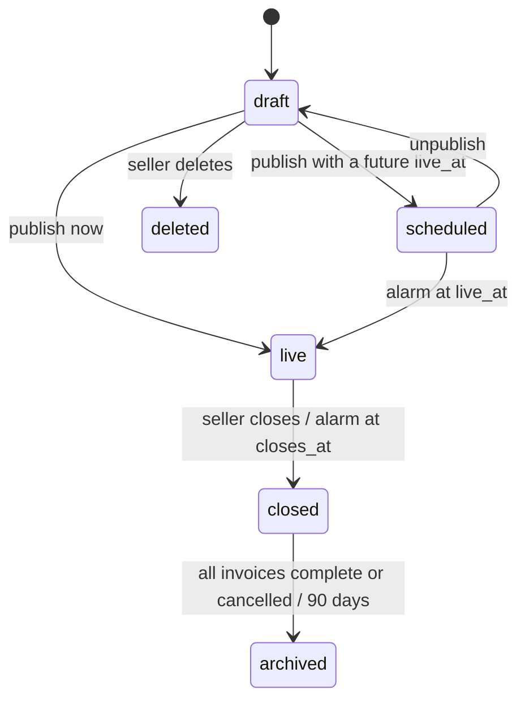
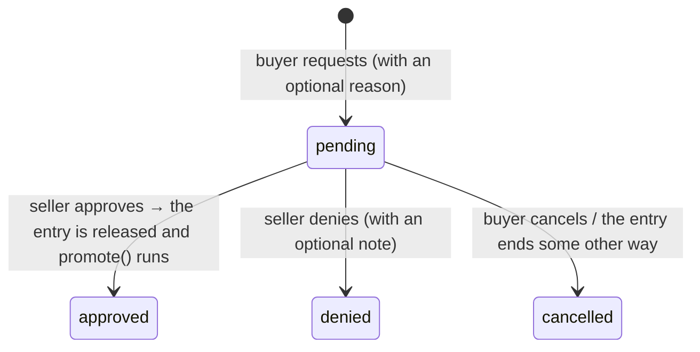
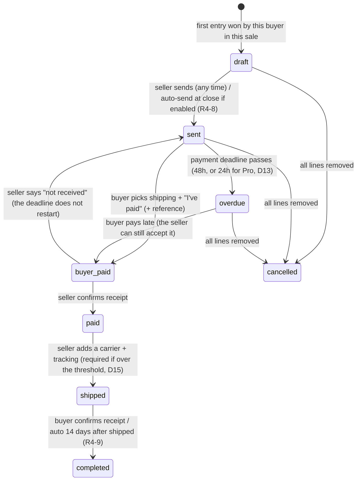

# State Machines and Rules

This document is the exact behavior spec for sales, items, entries (claims and
offers), take-backs and invoices. It is meant to be implemented as **pure
functions**: `(state, command, actor, now) → (newState, events)`. Those functions
are unit-tested without any I/O and called from the serialized write path
(see "Write path" at the end).

Decision references (D#) point to `PLAN.md` section 0. Questions marked **R4-#**
are open (see `PLAN.md` section 12).

---

## 1. Vocabulary

| Term | Meaning |
| --- | --- |
| **Entry** | One buyer's interest in one item. It is either a **claim** (at the asking price) or an **offer** (any amount, including above asking; D35). Claims and offers live in one table so they can be ranked together. |
| **Unit** | One sellable copy. An item with `quantity = 3` has 3 units. |
| **Won** | The entry holds a unit. It is binding and goes on the buyer's invoice. |
| **Open** | The entry is active but doesn't hold a unit. Depending on the item's state, it is either *awaiting the seller's decision* or a *backup*. |
| **Rank** | The order of open entries. Default: **amount descending, then time ascending**, so a claim at $40 ranks above an offer at $35, and an offer at $45 ranks above both. The seller can reorder manually (R4-2). |
| **Decision window** | The time the seller has to choose between a full-price claim and competing offers before the earliest claim wins automatically. **24h for free sellers; Pro sellers can configure it** (D25). |

---

## 2. Sale lifecycle



| State | Visible to buyers | Claims and offers | Notes |
| --- | --- | --- | --- |
| `draft` | No | No | Items can be edited freely. The free-tier item cap (10) is enforced on publish *and* on add. |
| `scheduled` | Yes (preview) | No, the buttons show a countdown | The preview opens at most 7 days before `live_at` (D42). Followers are notified on publish. |
| `live` | Yes | Yes | Maximum 14 days (D42). Price and quantity are locked on any item that has entries (D40). |
| `closed` | Yes (read-only) | No new entries | Decision windows, payment deadlines and promotions **keep running** after the sale closes. |
| `archived` | Yes, via the seller's history | No | |

**Free-tier limit:** at most 2 sales in `scheduled` + `live` at once (D30).

---

## 3. Item state (derived, never set by hand)

An item's displayed state is computed from its entries and units. It is stored
only as a cached column for filtering.


| Derived state | Condition |
| --- | --- |
| `available` | free units > 0 and no decision deadline is set |
| `deciding` | free units > 0 and `decision_deadline` is set |
| `sold_out` | free units = 0 (backups may still be open) |
| `withdrawn` | the seller withdrew the item; all entries end with `item_withdrawn` |
| `unsold` | the sale is closed, there are free units, and there are no open entries |

The buyer-facing badge also shows: **N claims / N offers** (counts are always
visible, D26), and offer **amounts** only if the sale's offer visibility is `visible` (D26).

---

## 4. Entry (claim / offer) lifecycle

```mermaid
stateDiagram-v2
    [*] --> won: claim, instant win (see 4.1)
    [*] --> open: claim or offer, otherwise
    open --> won: seller awards / window expires (earliest claim) / auto-promoted
    open --> countered: seller counters an offer
    countered --> won: buyer accepts and a unit is free
    countered --> open: buyer accepts but no unit is free (re-ranked at the counter amount)
    countered --> declined: buyer declines / counter expires
    open --> declined: seller declines an offer
    open --> withdrawn: buyer withdraws (an offer before it's accepted, R4-4) or leaves the backup queue (D14)
    open --> lost: the item's units are all paid for and the sale is closed
    open --> ended: item withdrawn / sale cancelled
    won --> rescinded: seller rescinds (any time; reason required)
    won --> released: Pro buyer rescinds (guardrails below) / take-back approved
    won --> fulfilled: the invoice containing it is completed
```



Terminal states: `declined`, `withdrawn`, `lost`, `ended`, `rescinded`,
`released`, `fulfilled`. Each terminal transition records `ended_reason` and
`ended_by`, and writes an audit log row.

### 4.1 Placing an entry

Run atomically per item (see the write path):

```
place(item, buyer, kind, amount):
  reject if: sale not live · buyer blocked · buyer fails the sale's buyer requirements
             (Pro buyers bypass the email-verified and new-account requirements, D29)
             · buyer is at the per-buyer unit limit for the item (D12) · buyer already
             has an open/countered entry on the item · kind=offer and offers are off
             · kind=offer and amount < hidden minimum (Pro sellers only, D27)
             → auto-decline with a generic "Offer not accepted" message

  if kind == claim:
      amount = item.price
      if freeUnits > 0 and no open offers and not sale.reviewEveryClaim and not deciding:
          → won                                   # the FB-style instant win
      elif freeUnits > 0:
          → open; if not deciding: set decision_deadline = now + window
      else:
          → open (backup)
  if kind == offer:
      if freeUnits == 0 and not sale.allowBackupOffers: reject (R4-1)
      → open                                      # offers never auto-win
      notify the seller
```

An offer on its own does **not** start a decision window. The seller can accept
it at any time. The window exists only so a full-price claimant isn't left
waiting indefinitely.

### 4.2 Awarding

```
award(item, entry, by=seller):
  require entry ∈ {open} and freeUnits > 0
  entry → won at entry.amount
  if freeUnits == 0 or no open claims remain: clear decision_deadline
  the other open entries stay open (now backups if sold_out)

on decision_deadline (DO alarm):
  while freeUnits > 0 and an open claim exists:
      award the earliest open claim               # D25: the claim wins by default
  clear decision_deadline
  (open offers stay open; the seller can still accept them while units are free)
```

### 4.3 Removing a winner and promoting

A winner can be removed in three ways:

| How | Who | Allowed when | Counts on the record as |
| --- | --- | --- | --- |
| **Seller rescind** | Seller | Any time before fulfilled. A reason is required (non-payment, buyer blocked, listing mistake, item damaged, other). After the buyer has marked the invoice paid, it needs confirmation and is flagged "refund owed" (R4-10). | `non_pay` on the buyer only if the reason is non-payment; otherwise a seller-side cancel |
| **Pro buyer rescind** | Buyer (Pro) | Until the invoice containing the entry is **sent**, max **5 per month** (D24) | `rescind` (a softer signal than non-pay) |
| **Take-back approved** | Seller approves the buyer's request | The request can be filed until the buyer marks the invoice paid (R4-11) | `takeback` |

Then:

```
promote(item):    # runs after any winner removal, unless the seller withdrew the item
  best = highest-ranked open entry
  if best is null: item → available (or unsold if the sale is closed)
  elif best.amount >= item.price: best → won (auto-promoted); notify; payment deadline starts with its invoice
  else: set decision_deadline = now + window; notify the seller "backup below asking — decide"   (R4-3)
```

The seller's one-click **"Rescind and pass to next"** (D13) is `rescind` followed by
`promote`. A plain **"Rescind"** without passing marks the item `withdrawn`.

### 4.4 Counter-offers

- The seller counters an `open` offer with `counter_amount`, and the entry becomes
  `countered`. The counter expires after 24h (R4-6: one round only at launch).
- The buyer **accepts**:
  - If a unit is free, the entry is `won` at `counter_amount`.
  - Otherwise it goes back to `open`, re-ranked at `counter_amount`, and the buyer is
    told: "Item was taken; you're backup #N at your accepted price."
- The buyer **declines**, or the counter expires: the entry becomes `declined`.

### 4.5 Sale close

- New entries are rejected.
- Items with free units and an open claim: if not already deciding, start a window.
- Items with free units and only open offers: the seller has 24h to accept, then they
  `lost`. *(This uses the same window length as the seller's decision window.)*
- Items with no entries become `unsold`. A one-click "Relist unsold" creates a new draft sale.
- Open backups stay open until every unit of their item is **paid**, then become `lost`.

---

## 5. Take-back requests



- At most one pending request per entry. After a denial, the buyer can't file again
  for the same entry.
- The claim stays `won` (and binding) while the request is pending.
- Pro buyers don't need take-backs while their rescind window is open; after the
  invoice is sent they use take-backs like everyone else.

---

## 6. Invoice lifecycle

An invoice groups one buyer's `won` entries in one sale.



**Rules:**
- **Lines** are added automatically when the buyer wins (or is promoted to) an entry.
  - While the invoice is `draft`, new wins are added to it.
  - After it is `sent`, new wins go into a new draft invoice (one open draft per
    buyer per sale). The "merge invoices" feature in v1 can combine them (D16).
- **Rescinding a line** on a `sent` / `overdue` invoice removes it and recalculates
  the total. On a `buyer_paid` / `paid` invoice, the line is kept but marked
  "refund owed" (R4-10).
- **The shipping option** is chosen by the buyer before "I've paid". Untracked
  options are hidden when the subtotal is over the seller's threshold ($20 free / $40 Pro, D15).
- **When the payment deadline passes,** the seller sees "rescind and pass to next"
  on each line. Automatic rescind is opt-in per sale (D13). When it's on, the
  `overdue` alarm runs rescind + promote on every line.
- **`gmv_cents`** is recorded when the invoice becomes `paid`; this feeds the fee ledger later (section 3a).

---

## 7. Timers (DO alarms, with a cron sweep as a backstop)

| Timer | Set when | On fire |
| --- | --- | --- |
| `sale.live_at` | publish (scheduled) | sale → live; notify followers |
| `sale.closes_at` | publish | close the sale (4.5) |
| `item.decision_deadline` | 4.1, 4.3, 4.5 | auto-award the earliest open claim |
| `entry.counter_expires_at` | counter | the entry is `declined` |
| `invoice.due_at` | invoice sent | → `overdue`; auto-rescind if enabled |
| `invoice.autocomplete_at` | shipped | → `completed` |
| `closed sale offer expiry` | sale close | unaccepted offers → `lost` |

Each sale's Durable Object keeps **one** alarm set to the earliest pending timer
across the sale's items and invoices. When it fires, it processes everything that
is due, then re-arms.

---

## 8. Who can do what

| Action | Buyer (free) | Buyer (Pro) | Seller (free) | Seller (Pro) |
| --- | --- | --- | --- | --- |
| Claim / offer | ✓ (email verified) | ✓ | — | — |
| Withdraw a pending offer / leave the backup queue | ✓ | ✓ | — | — |
| Rescind own winning claim | — (take-back request) | ✓ until the invoice is sent, 5/month | — | — |
| Award / decline / counter | — | — | ✓ | ✓ |
| Configure the decision window | — | — | fixed 24h | ✓ |
| Hidden minimum offer | — | — | — | ✓ |
| Offer amount visibility (blind / visible) | — | — | ✓ (D26) | ✓ |
| Payment deadline | — | — | 48h | 48h or 24h |
| Rescind and pass to next | — | — | ✓ | ✓ |
| Reorder backups | — | — | ✓ | ✓ |

All checks run server-side in the engine. The UI only hides the buttons.

---

## 9. Write path (concurrency)

The rules above involve read → decide → write (ranking, free units,
promotion), so a single SQL statement per action is no longer enough.

**Decision: each sale has a Durable Object that serializes writes per item.**
- Every mutation for a sale (place, award, counter, rescind, take-back, invoice
  transitions) is sent to that sale's DO.
- The DO holds one lock per item, so different items still run in parallel. It
  loads the item's entries from D1, runs the pure transition function, and writes
  the result as a single `db.batch()` (a transaction) with a version check on the item.
- After a successful write, it broadcasts diffs to connected WebSockets and
  enqueues notifications.
- **D1 remains the source of truth.** The DO holds no data that can't be rebuilt.
- The same DO owns the sale's alarm (section 7), so timed and user-triggered
  transitions go through the same lock.

*If load testing shows D1 round-trips make go-live claims too slow* (target: p95
< 300ms for 200 claims/second on one sale), move live entry state into the DO's
own SQLite storage, and copy it out to D1 through an outbox. Only the engine's storage
adapter changes; the transition functions stay the same.

Every transition writes an `audit_log` row in the same batch.
